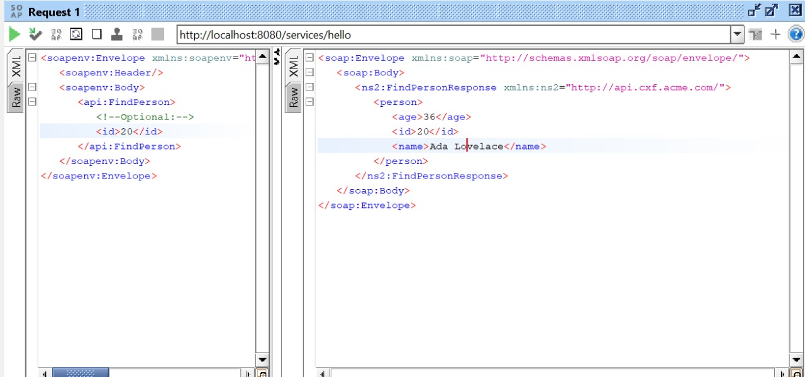
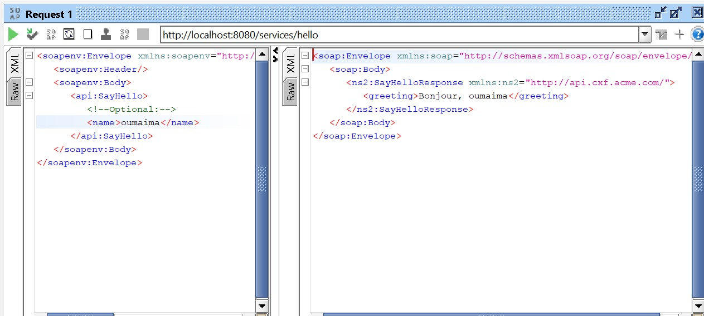

# TP12 : Service SOAP avec Apache CXF

Ce TP met en œuvre un service web SOAP à l’aide de la bibliothèque **Apache CXF**. Deux opérations sont testées : `FindPerson` et `SayHello`.

## 1. Requête FindPerson

> Cette requête récupère les informations d'une personne (id=20) : âge, id, nom.

## 2. Requête SayHello

> Cette requête retourne un message personnalisé : "Bonjour, oumaima".

## Technologies utilisées
- Java
- Maven
- Apache CXF
- Spring Boot (optionnel)
- SoapUI (pour les tests)

## Comment exécuter ?
1. Clonez le projet
2. Exécutez : `mvn clean install`
3. Lancez l’application
4. Testez avec SoapUI ou Postman
